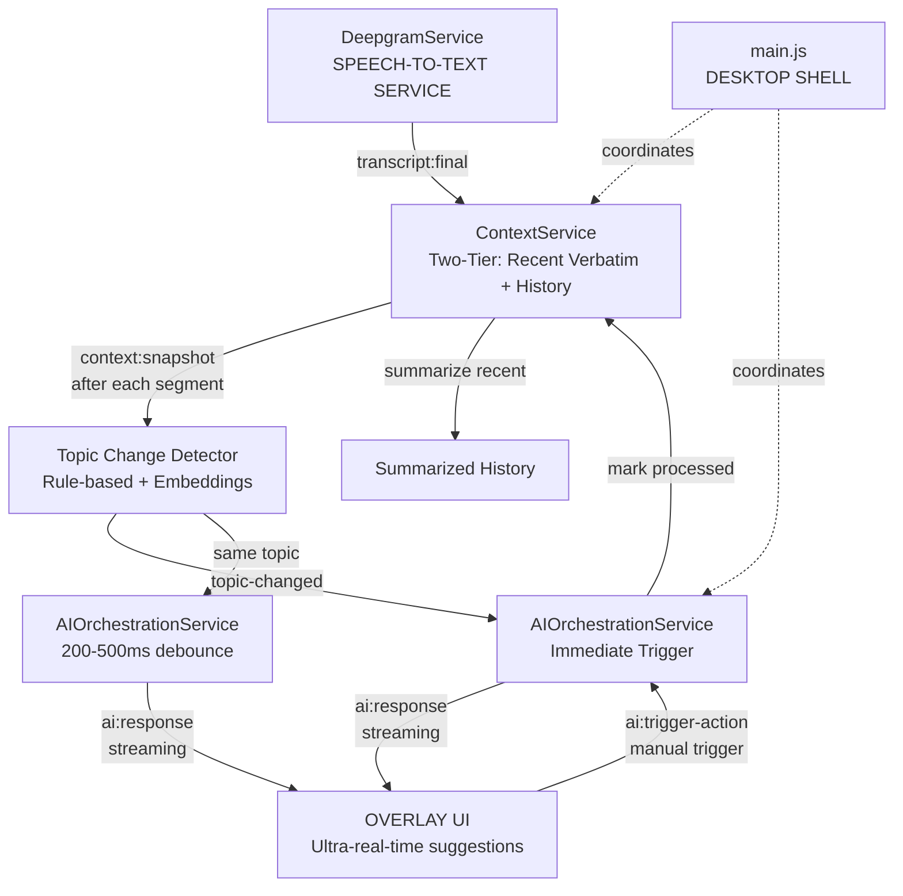

# AI Integration Implementation Plan

## Overview

Implement AI integration following the architecture rules. Start with **CONTEXT SERVICE** to manage two-tier rolling context (recent verbatim + summarized history), then build **AI ORCHESTRATION SERVICE** on top of it for ultra-real-time suggestions. Both services will follow the EventEmitter pattern and communicate via events.

**Key Features:**

- Two-tier context: Recent verbatim segments (2-3) + Summarized history
- Rolling summarization: Summarize recent context after LLM responses
- Ultra-real-time suggestions: 200-500ms debounce, immediate on topic change
- Topic change detection: Rule-based + semantic embeddings
- Cancel in-flight requests: Always use latest context
- Streaming responses: Partial suggestions for faster UI updates

## Architecture Flow



## Implementation Steps

### Phase 1: Context Service (Two-Tier System)

**File**: `src/main/services/ContextService.js`

**Responsibilities:**

- Maintain two-tier context: recent verbatim segments + summarized history
- Emit `context:snapshot` and `context:topic-changed` events
- Provide `getContextForLLM()` method that combines recent + history
- Rolling summarization: Summarize recent buffer after LLM processes it
- Topic change detection: Rule-based + semantic embeddings

**Key Features:**

- Extends `EventEmitter`
- **Two-tier system:**
  - `recentVerbatim`: Last 2-3 segments (~30-60 seconds) - exact transcription
  - `summarizedHistory`: Older context - compressed summaries
- **Rolling summarization**: After LLM response, summarize recent verbatim and merge into history
- **Topic change detection**: Hybrid approach (rule-based + semantic embeddings)
- Emits `context:snapshot` after each segment (for regular updates)
- Emits `context:topic-changed` when topic shift detected (for immediate triggers)

**Events Emitted:**

- `context:snapshot` - When context updates (after each final segment)
- `context:topic-changed` - When topic change detected (triggers immediate AI suggestions)
- `context:cleared` - When context is reset

**Methods:**

- `addSegment(segment)` - Add final transcript segment, detect topic change, emit events
- `getSnapshot()` - Get current context snapshot on-demand
- `getContextForLLM()` - Returns: recent verbatim text + summarized history (for LLM prompts)
- `markRecentAsProcessed()` - Called after LLM response, triggers async summarization
- `_summarizeRecentAsync()` - Summarize recent verbatim buffer (non-blocking)
- `_mergeSummaryIntoHistory(summary)` - Add summary to history, clear recent buffer
- `clear()` - Clear context (on session stop)

**Topic Change Detection:**

- **Tier 1: Rule-based** (fast, ~1ms):
  - Question words (what, why, how, etc.)
  - Time gaps (>5 seconds)
  - Low keyword overlap (<20%)
  - New named entities
  - Sentence structure changes
- **Tier 2: Semantic embeddings** (accurate, ~20-50ms):
  - Use `@xenova/transformers` with `all-MiniLM-L6-v2` model
  - Calculate cosine similarity between current and previous segments
  - Threshold: <0.7 similarity = topic changed
  - Lazy load model (first time only)

### Phase 2: Wire Context Service in main.js

**File**: `src/main/main.js`

**Changes:**

1. Import and instantiate `ContextService`
2. Listen to `transcript:final` from DeepgramService and call `contextService.addSegment()`
3. Listen to `context:snapshot` from ContextService (AIOrchestrationService listens internally, but can forward if needed)
4. Listen to `context:topic-changed` from ContextService (AIOrchestrationService listens internally for immediate triggers)
5. Clear context on session stop via `contextService.clear()`
6. Keep existing transcript forwarding to renderer (for UI display)
7. Note: Topic change detection happens inside ContextService, no additional wiring needed

### Phase 3: AI Orchestration Service (Ultra-Real-Time)

**File**: `src/main/services/AIOrchestrationService.js`

**Responsibilities:**

- Manage AI-related logic and LLM selection
- Build prompts from two-tier context (recent verbatim + summarized history)
- Route requests to LLM providers (cloud/local)
- Process streaming LLM responses and format for UI
- Handle different AI action types (suggestions, summaries, Q&A, etc.)
- Cancel in-flight requests when new context arrives

**Key Features:**

- Extends `EventEmitter`
- Receives `context:snapshot` and `context:topic-changed` events from ContextService
- **Ultra-real-time triggering:**
  - Topic change: Immediate (0ms debounce)
  - Regular updates: 200-500ms debounce
  - 2+ segments: 200ms debounce
  - Single segment: 500ms debounce
- **Cancel in-flight requests**: Always cancel previous request if new segment arrives
- **Streaming responses**: Support streaming for partial suggestions (1-2 second initial response)
- Receives manual AI requests via IPC (handled in main.js)
- Builds prompts using `getContextForLLM()` (recent verbatim + summarized history)
- Emits `ai:response` events with formatted results (partial and complete)
- Primary focus: `suggestion` action type for real-time talking points
- Supports additional action types: `summary`, `question`, `insight` (for manual triggers)

**Events Emitted:**

- `ai:response` - When AI response is ready (includes `isPartial` flag)
- `ai:error` - When AI request fails
- `ai:streaming` - For streaming chunk updates (future enhancement)

**Methods:**

- `constructor(contextService)` - Accept ContextService dependency, listen to context events
- `triggerAction(actionType, metadata)` - Trigger AI action manually (for IPC requests)
- `_handleContextUpdate(snapshot, isTopicChange)` - Handle context updates with appropriate debouncing
- `_generateSuggestions()` - Generate proactive suggestions (cancels in-flight if needed)
- `_cancelInFlightRequest()` - Cancel any ongoing LLM request
- `_callLLM(context, options)` - Call LLM with streaming support and abort signal
- `_extractPartialSuggestions(partialText)` - Extract suggestions from partial streaming response
- `buildPrompt(actionType, contextForLLM)` - Build prompt from two-tier context
- `processResponse(response, actionType)` - Format LLM response as action items for UI

**Ultra-Real-Time Triggering Strategy:**

- **Topic change detected**: Immediate trigger (0ms) - cancel any in-flight request
- **2+ segments accumulated**: 200ms debounce
- **Single segment**: 500ms debounce
- **Always cancel in-flight**: If new segment arrives while LLM is processing, cancel and restart
- **Streaming support**: Emit partial suggestions as they arrive (first suggestions in 1-2 seconds)

**Initial Implementation:**

- Start with mock responses that return 3-5 contextual talking points
- Implement request cancellation with AbortController
- Support streaming response parsing (extract partial suggestions)
- Structure for future LLM provider integration
- Format responses as action items compatible with existing `AIResponsePanel` component

### Phase 4: Wire AI Orchestration Service in main.js

**File**: `src/main/main.js`

**Changes:**

1. Import and instantiate `AIOrchestrationService` with ContextService dependency
2. AIOrchestrationService constructor automatically listens to:

   - `context:snapshot` events (for regular updates with debouncing)
   - `context:topic-changed` events (for immediate triggers)

3. Update `ai:trigger-action` IPC handler to call `aiOrchestrationService.triggerAction()` (for manual triggers)
4. Listen to `ai:response` events from AIOrchestrationService and forward to renderer via `webContents.send('ai:response', data)`

   - Handle both partial (`isPartial: true`) and complete responses

5. Listen to `ai:error` events and forward to renderer via `webContents.send('ai:error', error)`
6. After AIOrchestrationService receives response, it calls `contextService.markRecentAsProcessed()` to trigger summarization

### Phase 5: Update IPC and Preload

**Files:**

- `src/main/preload.js` - Already has `ai:trigger-action`, verify it works
- `src/main/main.js` - Update IPC handler (already exists, just needs implementation)

**New IPC Events** (webContents.send):

- `ai:response` - Send AI responses to renderer
- `ai:error` - Send AI errors to renderer

### Phase 6: Update Renderer to Handle AI Responses

**File**: `src/renderer/App.jsx`

**Changes:**

1. Listen to `ai:response` events from main process
2. Handle partial responses (`isPartial: true`):

   - Show partial suggestions immediately for faster UI updates
   - Update UI as partial suggestions arrive

3. Handle complete responses (`isPartial: false`):

   - Replace or merge with partial suggestions
   - Update `actions` state with final AI-generated suggestions

4. Handle `ai:error` events and display errors
5. Consider showing loading state while waiting for suggestions

## Implementation Details

### ContextService Data Structure

**Two-Tier Context:**

```javascript
// Internal state
{
  recentVerbatim: [
    {
      text: string,
      timestamp: number,
      confidence: number,
      duration: number
    }
  ], // Last 2-3 segments, ~30-60 seconds (exact transcription)
  
  summarizedHistory: [
    {
      summary: string, // Compressed summary of older segments
      timestamp: number, // Timestamp of first segment in summary
      segmentCount: number, // Number of segments summarized
      duration: number // Total duration of summarized segments
    }
  ], // Last 5-10 summaries (represents ~5-10 minutes of conversation)
  
  currentTopic: string | null, // Current topic identifier
  previousEmbedding: Float32Array | null // Previous segment embedding (for similarity)
}

// ContextSnapshot format (emitted after each final segment)
{
  recentVerbatim: [...], // Last 2-3 segments
  summarizedHistory: [...], // Older context summaries
  metadata: {
    recentCount: number,
    historySummaryCount: number,
    oldestTimestamp: number,
    newestTimestamp: number
  }
}

// getContextForLLM() returns (for LLM prompts)
{
  recentVerbatim: string, // Concatenated recent verbatim text
  summarizedHistory: string, // Concatenated summary texts
  fullContext: string // Combined context for prompt building
}
```

**Rolling Window Behavior:**

- **Recent verbatim**: Maximum 3 segments (~30-60 seconds)
- **Summarized history**: Maximum 10 summaries (~5-10 minutes)
- **When recent buffer exceeds limit**: Oldest segment queued for summarization
- **After LLM response**: Recent buffer summarized and merged into history
- **Snapshot emitted**: Immediately after each segment addition
- **Topic change detection**: Runs on each segment addition

### AIOrchestrationService Action Types

- `suggestion` - **Primary**: Generate contextual talking points/suggestions (proactive, real-time)
- `summary` - Generate summary of recent conversation (manual trigger)
- `question` - Answer question about conversation (manual trigger)
- `insight` - Generate insights from conversation (manual trigger)

**Suggestion Response Format:**

```javascript
// Partial response (streaming)
{
  actionType: 'suggestion',
  suggestions: [
    {
      id: string,
      type: string, // e.g., 'define', 'question', 'suggest'
      label: string, // Display text
      icon: string // Icon name for UI
    }
  ],
  isPartial: true, // Indicates this is a partial/streaming response
  timestamp: number
}

// Complete response
{
  actionType: 'suggestion',
  suggestions: [
    {
      id: string,
      type: string,
      label: string,
      icon: string
    }
  ],
  isPartial: false,
  timestamp: number
}
```

## Testing Strategy

1. **ContextService:**

   - Test two-tier system: recent verbatim (max 3 segments) + summarized history
   - Test topic change detection: rule-based heuristics
   - Test semantic embeddings: similarity calculation (if model loaded)
   - Test rolling summarization: recent buffer → summary → history merge
   - Test `getContextForLLM()`: combines recent verbatim + summarized history
   - Test snapshot and topic-changed event emission
   - Test context clearing

2. **AIOrchestrationService:**

   - Test ultra-real-time triggering:
     - Topic change: immediate trigger (0ms)
     - 2+ segments: 200ms debounce
     - Single segment: 500ms debounce
   - Test request cancellation: cancel in-flight when new segment arrives
   - Test streaming responses: extract partial suggestions from streaming text
   - Test prompt building from two-tier context
   - Test response formatting as action items (with mocks)
   - Test proactive suggestion generation

3. **Integration:**

   - Test full flow: transcript:final → context:snapshot → topic detection → ai:response → UI
   - Test topic change flow: topic-changed event → immediate trigger → suggestions
   - Test rolling summarization: LLM response → markRecentAsProcessed → summarize → merge
   - Test request cancellation: rapid segments → cancel previous → use latest context
   - Test partial suggestions: streaming response → partial UI update → complete update
   - Test manual trigger via IPC still works

## Implementation Notes

### Topic Change Detection Implementation

**Phase 1: Rule-Based (Initial)**

- Implement rule-based heuristics (question words, time gaps, keyword overlap, etc.)
- Fast and sufficient for most cases
- Easy to tune and debug

**Phase 2: Add Semantic Embeddings (Enhancement)**

- Install `@xenova/transformers` package
- Use `all-MiniLM-L6-v2` model (lightweight, ~90MB)
- Lazy load model on first use
- Calculate cosine similarity between segments
- Threshold: <0.7 similarity = topic changed
- Fallback to rule-based if embedding fails

### Summarization Strategy

**Phase 1: Simple Compression (Initial)**

- Extract first/last sentences from recent verbatim
- Fast, no additional LLM call
- Good enough for initial implementation

**Phase 2: LLM-Based Summarization (Future)**

- Call LLM to summarize recent buffer after suggestions received
- More accurate but adds latency
- Can be async/non-blocking (doesn't delay next suggestion)
- Only summarize if recent buffer has substantial content (>200 chars)

### Streaming Response Handling

- Parse streaming text for numbered/bulleted lists
- Extract partial suggestions as they arrive
- Emit partial responses with `isPartial: true` flag
- UI can show partial suggestions immediately, update when complete

## Future Enhancements (Out of Scope)

- LLM Provider integrations (OpenAI, Anthropic, Local LLM)
- Full streaming API support (chunk-by-chunk updates)
- LLM-based summarization (currently simple compression)
- Key points extraction
- OCR integration
- Settings & Storage service for AI configuration
- Advanced topic modeling (multi-topic detection)

